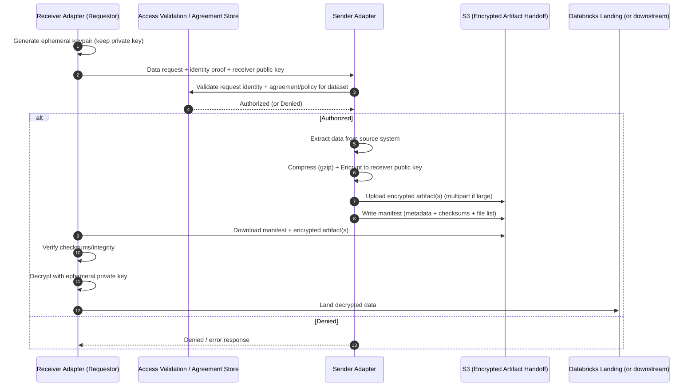
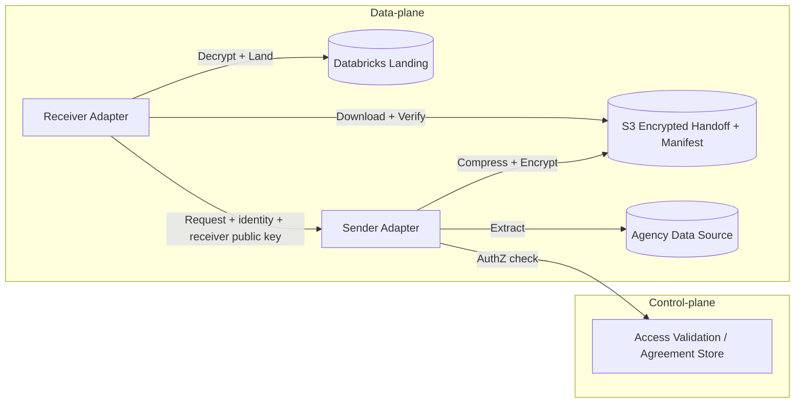
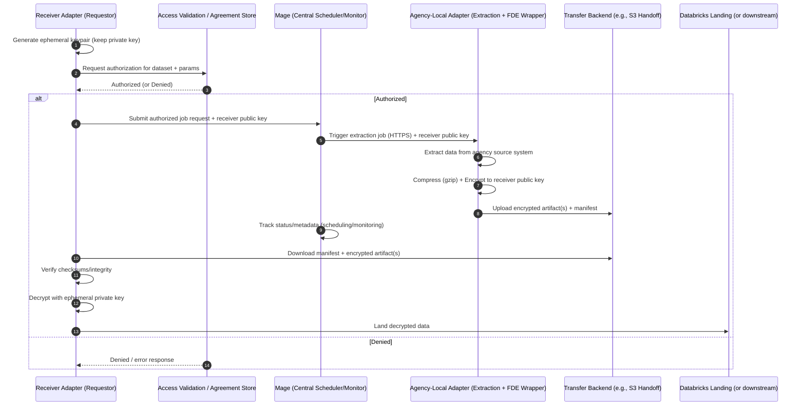
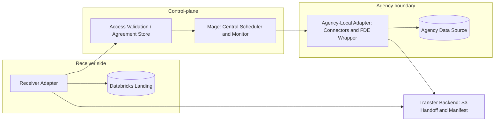

# ADR 0001 Diagrams: FDE Architecture Options

## Option 1 (Case A): FDE Transfer Flow (Receiver-initiated)

### Sequence diagram

### Component diagram

## Option 2: Mage AI as Orchestrator + Agency-Local Adapter Execution

### Sequence diagram

### Component diagram

