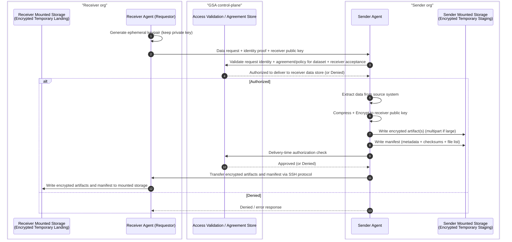
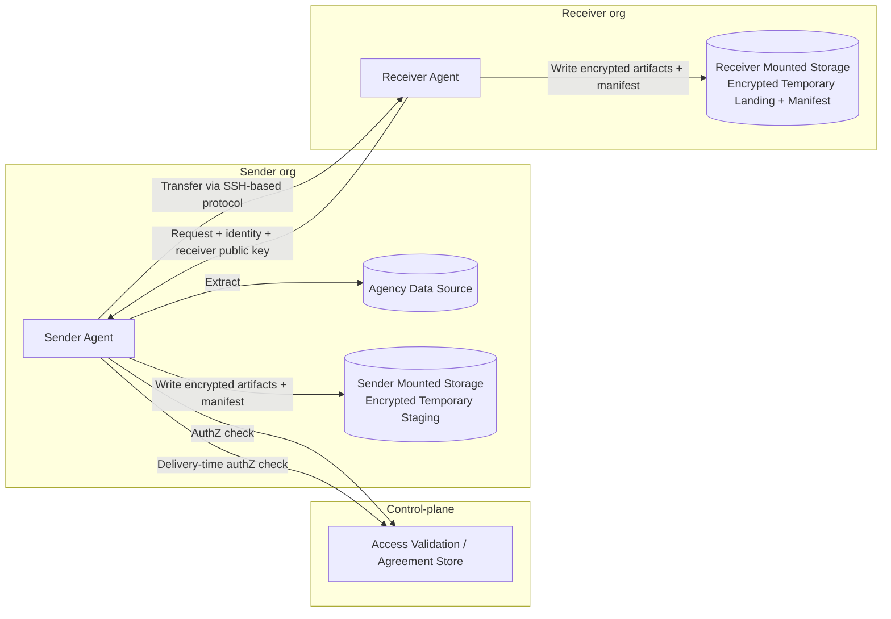
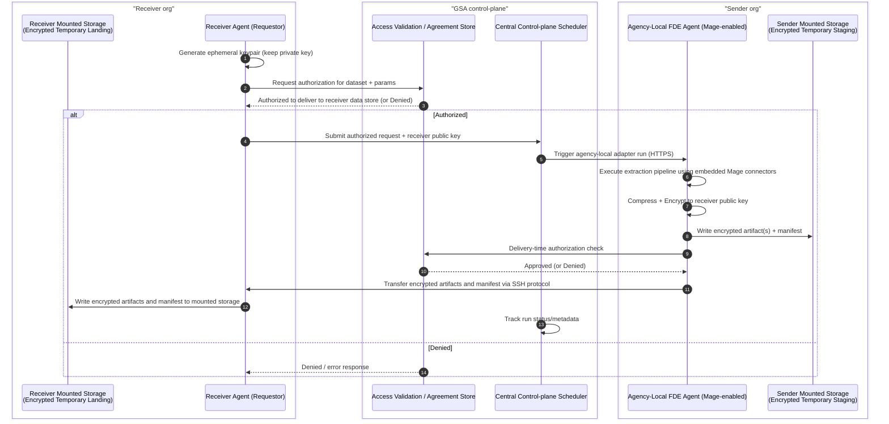
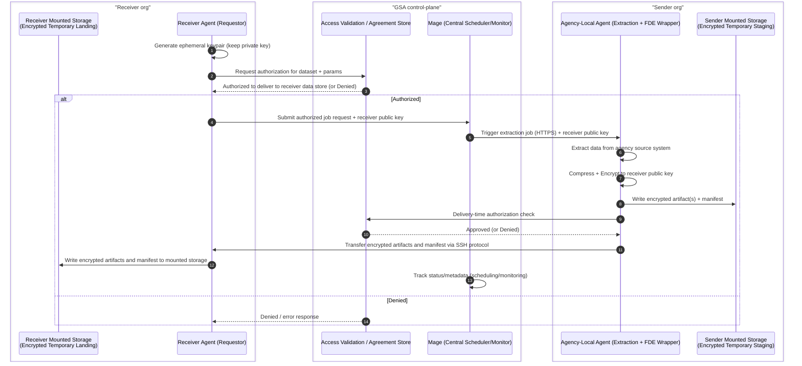
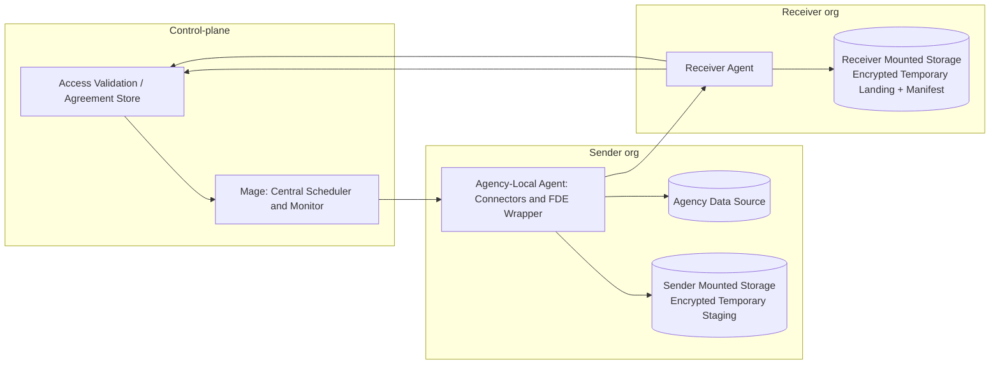
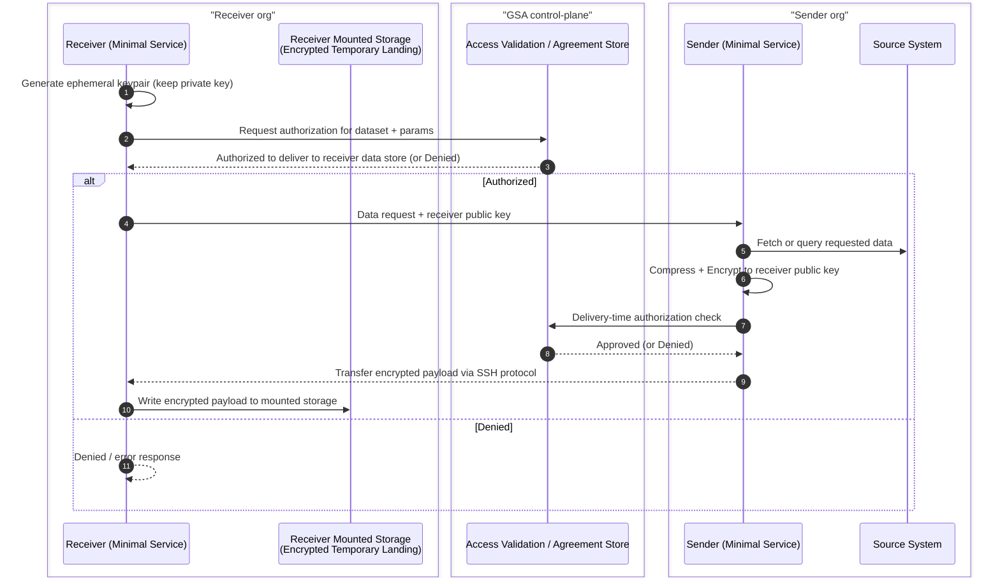
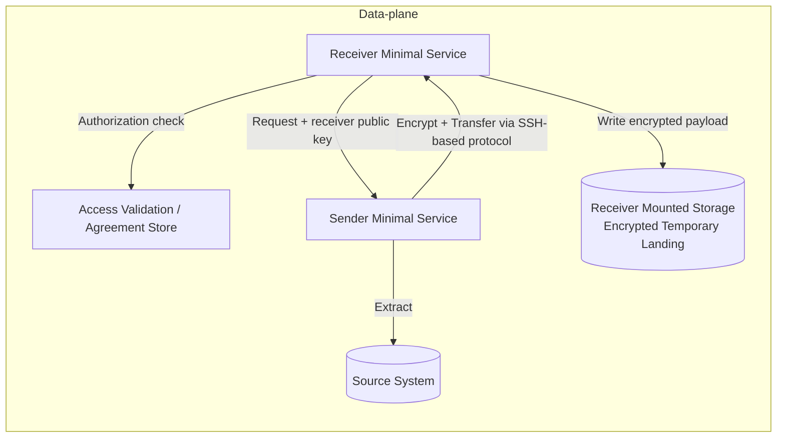

# ADR 0001 Diagrams: FDE Architecture Options (v0.03)

## Option 1: Container-based Adapter Service (Cloud-agnostic)

### Sequence diagram

### Component diagram

## Option 2: Mage AI Embedded in Agency-Local FDE Adapter (Maximize Connector and Pipeline Capabilities)

### Sequence diagram

### Component diagram

## Option 3: Mage AI as Control-plane Orchestrator + Adapter Security Wrapper

### Sequence diagram

### Component diagram

## Option 4: Minimal Microservices POC (Fastest v0.03)

### Sequence diagram

### Component diagram

