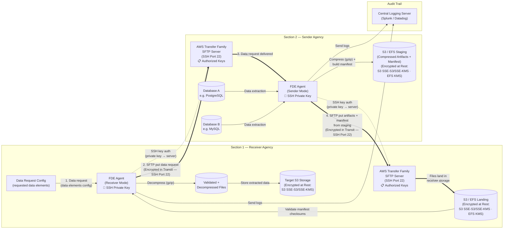
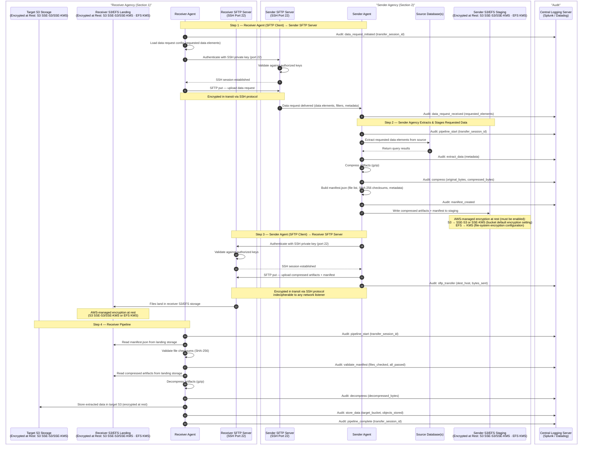

# ADR 003 Diagrams: MVP Architecture — FDE Agent V1 POC

## High-Level Component Diagram

```mermaid
flowchart LR
  subgraph ReceiverAgency["Section 1 — Receiver Agency"]
    RCFG["Data Request Config<br/>(requested data elements)"]
    RA["FDE Agent<br/>(Receiver Mode)<br/>🔑 SSH Private Key"]
    R_SFTP["AWS Transfer Family<br/>SFTP Server<br/>(SSH Port 22)<br/>📋 Authorized Keys"]
    RL[("S3 / EFS Landing<br/>(Encrypted at Rest:<br/>S3 SSE-S3/SSE-KMS · EFS KMS)")]
    RF[("Validated +<br/>Decompressed Files")]
    TS3[("Target S3 Storage<br/>(Encrypted at Rest:<br/>S3 SSE-S3/SSE-KMS)")]
  end

  subgraph SenderAgency["Section 2 — Sender Agency"]
    SDB_A[(Database A<br/>e.g. PostgreSQL)]
    SDB_B[(Database B<br/>e.g. MySQL)]
    SA["FDE Agent<br/>(Sender Mode)<br/>🔑 SSH Private Key"]
    SS[("S3 / EFS Staging<br/>(Compressed Artifacts + Manifest)<br/>(Encrypted at Rest:<br/>S3 SSE-S3/SSE-KMS · EFS KMS)")]
    S_SFTP["AWS Transfer Family<br/>SFTP Server<br/>(SSH Port 22)<br/>📋 Authorized Keys"]
  end

  subgraph AuditPlane["Audit Trail"]
    CLS["Central Logging Server<br/>(Splunk / Datadog)"]
  end

  %% Step 1: Receiver Agent (SFTP client) connects to Sender's SFTP server
  RCFG -->|"1. Data request<br/>(data elements config)"| RA
  RA -.->|"SSH key auth<br/>(private key → server)"| S_SFTP
  RA ==>|"2. SFTP put data request<br/>(Encrypted in Transit — SSH Port 22)"| S_SFTP
  S_SFTP ==>|"3. Data request delivered"| SA

  %% Step 2: Sender Agent (SFTP client) connects to Receiver's SFTP server
  SDB_A -->|Data extraction| SA
  SDB_B -->|Data extraction| SA
  SA -->|"Compress (gzip) +<br/>build manifest"| SS
  SA -.->|"SSH key auth<br/>(private key → server)"| R_SFTP
  SA ==>|"4. SFTP put artifacts + manifest<br/>from staging<br/>(Encrypted in Transit — SSH Port 22)"| R_SFTP
  R_SFTP ==>|"Files land in<br/>receiver storage"| RL
  RL -->|"Validate manifest checksums"| RA
  RA -->|"Decompress (gzip)"| RF
  RF -->|"Store extracted data"| TS3
  SA -->|"Send logs"| CLS
  RA -->|"Send logs"| CLS
```

---

## Sequence Diagram — End-to-End MVP Flow

```mermaid
sequenceDiagram
  autonumber
  box "Receiver Agency (Section 1)"
    participant TS3 as Target S3 Storage<br/>(Encrypted at Rest: S3 SSE-S3/SSE-KMS)
    participant RL as Receiver S3/EFS Landing<br/>(Encrypted at Rest: S3 SSE-S3/SSE-KMS · EFS KMS)
    participant RA as Receiver Agent
    participant R_SFTP as Receiver SFTP Server<br/>(SSH Port 22)
  end
  box "Sender Agency (Section 2)"
    participant S_SFTP as Sender SFTP Server<br/>(SSH Port 22)
    participant SA as Sender Agent
    participant SDB as Source Database(s)
    participant SS as Sender S3/EFS Staging<br/>(Encrypted at Rest: S3 SSE-S3/SSE-KMS · EFS KMS)
  end
  box "Audit"
    participant CLS as Central Logging Server<br/>(Splunk / Datadog)
  end

  Note over RA,SA: Step 1 — Receiver Agent (SFTP Client) → Sender SFTP Server
  RA->>CLS: Audit: data_request_initiated (transfer_session_id)
  RA->>RA: Load data request config (requested data elements)
  RA->>S_SFTP: Authenticate with SSH private key (port 22)
  S_SFTP->>S_SFTP: Validate against authorized keys
  S_SFTP-->>RA: SSH session established
  RA->>S_SFTP: SFTP put — upload data request
  Note over RA,S_SFTP: Encrypted in transit via SSH protocol
  S_SFTP->>SA: Data request delivered (data elements, filters, metadata)
  SA->>CLS: Audit: data_request_received (requested_elements)

  Note over SA,SS: Step 2 — Sender Agency Extracts & Stages Requested Data
  SA->>CLS: Audit: pipeline_start (transfer_session_id)
  SA->>SDB: Extract requested data elements from source
  SDB-->>SA: Return query results
  SA->>CLS: Audit: extract_data (metadata)

  SA->>SA: Compress artifacts (gzip)
  SA->>CLS: Audit: compress (original_bytes, compressed_bytes)

  SA->>SA: Build manifest.json (file list, SHA-256 checksums, metadata)
  SA->>CLS: Audit: manifest_created

  SA->>SS: Write compressed artifacts + manifest to staging
  Note over SS: AWS-managed encryption at rest (must be enabled):<br/>S3 → SSE-S3 or SSE-KMS (bucket default encryption setting)<br/>EFS → KMS (file-system encryption configuration)

  Note over SA,R_SFTP: Step 3 — Sender Agent (SFTP Client) → Receiver SFTP Server
  SA->>R_SFTP: Authenticate with SSH private key (port 22)
  R_SFTP->>R_SFTP: Validate against authorized keys
  R_SFTP-->>SA: SSH session established
  SA->>R_SFTP: SFTP put — upload compressed artifacts + manifest
  SA->>CLS: Audit: sftp_transfer (dest_host, bytes_sent)
  Note over SA,R_SFTP: Encrypted in transit via SSH protocol<br/>indecipherable to any network listener

  R_SFTP->>RL: Files land in receiver S3/EFS storage
  Note over RL: AWS-managed encryption at rest<br/>(S3 SSE-S3/SSE-KMS or EFS KMS)

  Note over TS3,RA: Step 4 — Receiver Pipeline
  RA->>CLS: Audit: pipeline_start (transfer_session_id)
  RA->>RL: Read manifest.json from landing storage
  RA->>RA: Validate file checksums (SHA-256)
  RA->>CLS: Audit: validate_manifest (files_checked, all_passed)

  RA->>RL: Read compressed artifacts from landing storage
  RA->>RA: Decompress artifacts (gzip)
  RA->>CLS: Audit: decompress (decompressed_bytes)

  RA->>TS3: Store extracted data in target S3 (encrypted at rest)
  RA->>CLS: Audit: store_data (target_bucket, objects_stored)
  RA->>CLS: Audit: pipeline_complete (transfer_session_id)
```
