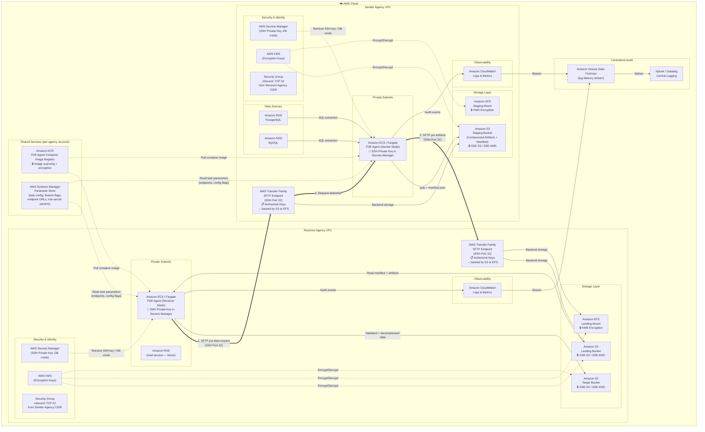
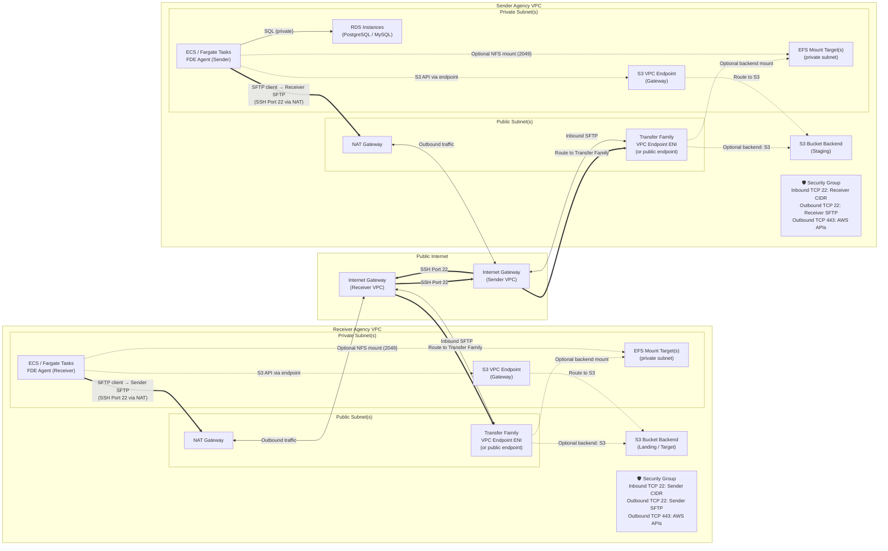
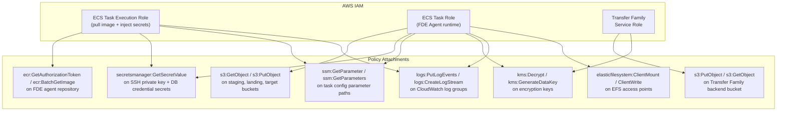
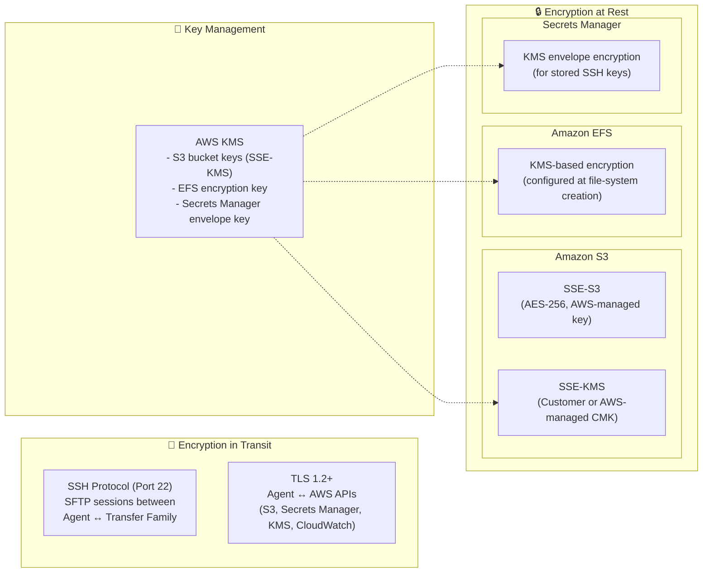
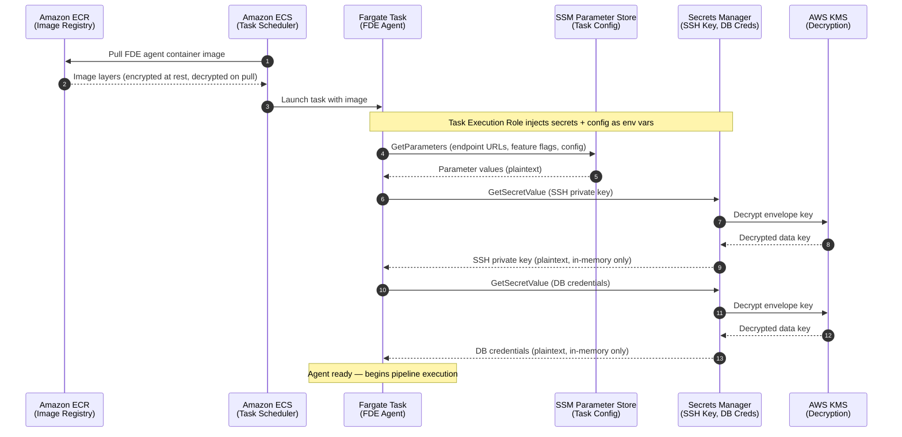

# ADR 003 Diagrams: MVP AWS Infrastructure — FDE Agent V1 POC

These diagrams map the logical MVP architecture from [003-mvp-architecture-diagram.md](./003-mvp-architecture-diagram.md) to concrete AWS services and infrastructure boundaries.

---

## AWS Infrastructure — Full View

---

## AWS Network & Security Diagram

---

## AWS Service Mapping

| Logical Component (from 003 diagrams) | AWS Service | Key Configuration | Cost Dimension |
|---|---|---|---|
| FDE Agent container image | **Amazon ECR** | Private repository; image scanning enabled; encrypted at rest | Storage (GB/month) + data transfer out |
| FDE Agent (Sender / Receiver) | **Amazon ECS on Fargate** | Task in private subnet; pulls image from ECR; IAM task role for S3, SSM, Secrets Manager, CloudWatch | vCPU-hours + GB-memory-hours per task |
| Task configuration & parameters | **AWS Systems Manager Parameter Store** | Endpoint URLs, feature flags, non-secret config injected as env vars at task start | Standard params: free; Advanced params: per param/month |
| AWS Transfer Family SFTP Server | **AWS Transfer Family** (SFTP protocol) | Public or VPC endpoint; SSH authorized keys; backend = S3 bucket or EFS mount | Per protocol per hour + data upload (GB) |
| S3 Landing / Staging / Target | **Amazon S3** | Bucket default encryption: SSE-S3 or SSE-KMS; bucket policy restricts access to agent role + Transfer Family | Storage (GB/month) + requests + data transfer |
| EFS Landing / Staging (alternative) | **Amazon EFS** | Encrypted at rest via KMS; mounted to Fargate tasks and/or Transfer Family | Storage (GB/month) by class + throughput |
| Source Databases | **Amazon RDS** (PostgreSQL, MySQL) | Private subnet; security group allows inbound from agent tasks only | Instance hours + storage + I/O |
| SSH Private Key / DB credentials | **AWS Secrets Manager** | Agent retrieves at task start; automatic rotation (production) | Per secret/month + per 10K API calls |
| Encryption keys | **AWS KMS** | Customer-managed or AWS-managed keys for S3 SSE-KMS, EFS, Secrets Manager, ECR | Per key/month + per 10K API requests |
| Security Groups | **VPC Security Groups** | Inbound TCP 22 from remote agency CIDR; outbound TCP 22 to remote SFTP; outbound 443 for AWS APIs | No additional charge |
| Network (outbound) | **NAT Gateway** | Agent SFTP client traffic exits via NAT → Internet Gateway | Per hour + per GB processed |
| Network (S3 access) | **S3 VPC Gateway Endpoint** | Keeps S3 traffic off the public internet | No additional charge |
| Agent logs | **Amazon CloudWatch Logs** | Structured audit events from ECS tasks | Ingestion (GB) + storage (GB/month) |
| Log delivery | **Amazon Kinesis Data Firehose** | Streams CloudWatch logs to Splunk / Datadog | Per GB ingested |
| Central Logging | **Splunk / Datadog** | Receives audit events via Firehose delivery stream | Per vendor licensing / GB ingested |

---

## IAM Roles & Policies (Summary)

---

## Encryption Layers — AWS Service View

---

## ECS Task Bootstrap — ECR, SSM & Secrets Manager

