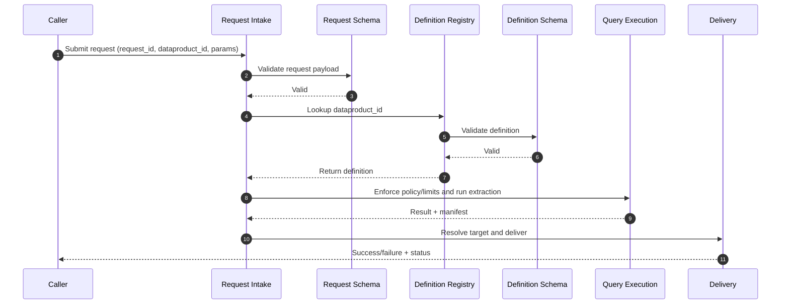

# ADR: Multi-Dataproduct Configuration and Request Model

## Context

Current query mode accepts one runtime query contract (`SENDER_QUERY_INPUT_JSON`) and validates it against a static template allow-list.

Decision ownership and consultation participants will be refined as we onboard customers and learn more through implementation and operations.

The product direction requires:
- Multiple data products with different metadata and extraction rules.
- Sender-side dynamic selection of a data product for extraction and sharing.
- Receiver-side request capability (initially API/event driven, later UI driven).

## Decision

Adopt a canonical `dataproduct` definition schema and a separate `request` schema.

Use a hybrid configuration approach:
- Source of truth in versioned config files (GitOps friendly).
- Runtime materialization into a lightweight registry layer (cache/service) for lookup by `dataproduct_id`.

This enables immediate implementation using files while keeping a clean path to UI/API based request workflows.

## Runtime Sequence (Short)

## Config File Interaction

- `config/dataproducts/schema/dataproduct-request.schema.json`: validates incoming request payload structure.
- `config/dataproducts/examples/requests/*.json`: committed sanitized request examples for onboarding and validation.
- `config/dataproducts/schema/dataproduct.schema.json`: validates the canonical dataproduct definition contract.
- `config/dataproducts/examples/definitions/*.json`: committed sanitized definition examples for onboarding and validation.
- Runtime order: validate request -> resolve definition from runtime config/registry -> enforce definition constraints (policy, params, limits, delivery) -> validate/execute template -> deliver and audit.

## File-by-File Runtime Mapping

1. Incoming payload is checked against `config/dataproducts/schema/dataproduct-request.schema.json`.
2. Example request payloads in `config/dataproducts/examples/requests/` provide committed reference contracts for agency onboarding.
3. `request.dataproduct_id` is used to select a definition from the runtime config/registry source (reference examples are in `config/dataproducts/examples/definitions/`).
4. The selected definition is validated against `config/dataproducts/schema/dataproduct.schema.json`.
5. The validated definition supplies runtime controls: access policy, parameter contract, limits, template_id, and allowed delivery targets.
6. Extraction runs using the resolved template and guardrails, then delivery is routed using `delivery_target_id` from the request if allowed by the selected definition.

## Repo vs Flux Ownership

1. Keep in `ttse-redwood` (application-owned)
	- Canonical schemas in `config/dataproducts/schema/` (source of truth for contract shape).
	- Committed sanitized examples in `config/dataproducts/examples/` for onboarding and shared understanding.
	- Application code for validation, policy enforcement, and execution flow.
	- ADR and implementation documentation.

2. Keep in `tts-flux-config` (environment-owned deployment config)
	- Runtime dataproduct definitions used by each environment.
	- Runtime request payload injection when using env-driven input (for example `SENDER_QUERY_INPUT_JSON`).
	- Helm values and environment variable wiring per environment.
	- Kubernetes Secrets/ESO mappings and secret references.
	- Environment-specific guardrails and operational tuning values.

3. Future-state target
	- Move per-run requests out of Git/Helm env injection into API/event intake.
	- Keep schema contracts and validation behavior owned by `ttse-redwood`.
	- Keep deployment/secrets and environment policy overlays owned by `tts-flux-config`.

## Required Dataproduct Fields

Each data product must include:

1. Identity and lifecycle
	- `dataproduct_id` (stable unique id)
	- `name`
	- `version`
	- `status` (`draft`, `active`, `deprecated`, `retired`)
	- `owner_agency`
	- `data_owner` (name/team/contact)

2. Access and policy
	- `allowed_requesting_agencies`
	- `allowed_requesting_roles` (optional)
	- `approval_policy` (auto, owner_approval, dual_approval)
	- `classification` (for example CUI/PII tags)
	- `retention_policy_days`

3. Extraction contract
	- `source_type` (`sql` and `file` now, extensible to `api` later)
	- `engine` (currently `postgres` for `sql`, `s3-file` for `file`; extensible to additional SQL engines and file backends)
	- `template_id` (maps to allow-listed extraction template)
	- `required_params` and `optional_params` with type definitions
	- `default_row_limit`
	- `max_row_limit`
	- `default_timeout_seconds`
	- `max_timeout_seconds`
	- `allowed_select_fields` (optional strict allow-list)
	- `allowed_filters` with allowed operators (min/max/equal/in)

4. Delivery contract
	- `output_format` (`csv`, future: `parquet`, `jsonl`)
	- `naming_convention` and `file_prefix` (for example: `agency_dataproduct_yyyymmdd_hhmmss_requestid.csv`)
	- `delivery_targets` (allowed destination profile IDs resolved to S3/SFTP connection settings at runtime; maintained in versioned delivery-target configuration and loaded into the runtime registry)
	- `manifest_requirements` (required metadata fields)

5. Operational controls
	- `schedule_constraints` (optional allowed execution windows)
	- `idempotency_scope` (what defines same request)
	- `audit_level` (optional, future: `standard` or `verbose`; MVP uses global default)
	- `notifications` (optional, future capability; not implemented in MVP/current state)

## Request Fields (for sender direct use and future receiver UI/API)

Each extraction request should include:
- `request_id`
- `dataproduct_id`
- `requesting_agency`
- `requested_by`
- `params` (must conform to dataproduct parameter schema)
- `requested_row_limit` (optional, capped by product max)
- `requested_timeout_seconds` (optional, capped by product max)
- `delivery_target_id` (optional override if permitted)
- `justification` (optional now, required when policy demands)

## Options for Maintaining Dataproduct Definitions

1. In-repo JSON/YAML only
	- Pros: simple, auditable, no new infra.
	- Cons: weak for dynamic request flows and self-service UX.

2. Central registry service/database only
	- Pros: dynamic updates, best for UI/API and governance workflows.
	- Cons: new infrastructure, higher delivery risk now.

3. Hybrid (chosen)
	- Pros: fast start with Git-managed files, clean migration path to API/UI.
	- Pros: preserves change control and enables runtime lookup by id.
	- Cons: requires sync/validation path between file and runtime registry.

## Stories / Sub-Tasks

1. Schema and contracts
	- Define JSON schema for dataproduct and request payload.
	- Add validation tests and invalid-case fixtures.
	- Add `DataproductDefinition` and `DataproductRequest` models.
	- Add schema validation on startup and CI.

2. Config repository and loader
	- Create dataproduct definition directory structure.
	- Build loader + cache + version resolution.
	- Introduce `DATAPRODUCT_ID` and `DATAPRODUCT_REQUEST_JSON` runtime inputs.
	- Replace direct template-only validation with `dataproduct_id -> definition -> template validation`.

3. Sender runtime integration
	- Add `DATAPRODUCT_ID` and request payload ingestion.
	- Refactor sender query flow to resolve product before adapter execution.
	- Pass resolved product constraints into query adapter and template checks.
	- Continue enforcing global caps (`MAX_QUERY_ROW_LIMIT`, `MAX_QUERY_TIMEOUT_SECONDS`) as outer guardrails.

4. Policy and approval flow
	- Extend policy inputs and decisions for product-specific access rules.
	- Add approval decision logging and audit trails.
	- Extend policy approver inputs to include requester, dataproduct classification, and approval mode.
	- Emit audit events for request_received, request_approved/denied, extraction_started/completed.

5. Query template and guardrail alignment
	- Map product definitions to existing `ALLOWLISTED_QUERY_TEMPLATES`.
	- Add typed parameter/operator enforcement.
	- Enforce param types/operators against product definition before query execution.
	- Include `dataproduct_id`, `version`, and `request_id` in fingerprint/idempotency marker payloads.

6. Receiver request intake
	- Implement non-UI request intake endpoint/queue.
	- Add state tracking and retry/error handling.
	- Add request intake interface (initially file/event/API endpoint, UI later).
	- Persist request state (`queued`, `approved`, `running`, `succeeded`, `failed`, `denied`).

7. Observability and operations
	- Add product/request ids to structured logs and metrics.
	- Add dashboards and alerting for denied/failed requests.

8. Documentation and rollout
	- Publish onboarding guide for new dataproducts.
	- Start with pilot onboarding for 1-2 agencies (as available) and iteratively evolve the governance workflow based on learnings.

## Consequences

Good:
- Supports many dataproducts without code changes per product.
- Enables sender dynamic selection now and receiver-driven requests later.
- Keeps governance and auditability strong through explicit schemas.

Trade-off:
- Introduces schema/version management and migration responsibilities.

## Revisit Triggers

Revisit when:
- Request volume or latency requires a fully managed registry service.
- Cross-agency governance needs workflow orchestration beyond current policy module.
- Non-SQL data product types become a near-term requirement.
