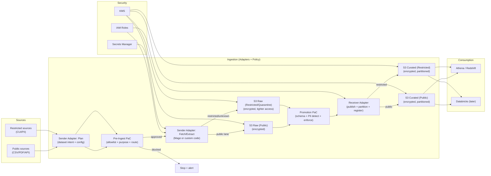

# ITA Data Ingestion – Architecture & Source Inventory

This document captures:

1. **What data is available** from the provided public trade-related sources  
2. **How that data can be accessed** (API, CSV, Excel, PDF, portals)  
3. **How we plan to ingest it** using Sender / Receiver data adapters  
4. **The agreed AWS-based architecture**, including Policy-as-Code (PaC)

This is written to be understandable by **business and non-technical users**, while remaining precise enough for engineering implementation.

---

## 1. Source Inventory – What Data Exists and How It Can Be Ingested

| Source URL | Agency / Owner | What Data Is Available | Download / Access Options | Parsing & Adapter Notes |
|---|---|---|---|---|
| <https://www.census.gov/foreign-trade/schedule.html> | US Census Bureau | Trade release schedules (FT900 timing, publication calendar) | HTML page only | **Not a dataset**. Metadata-only source used for scheduling and pipeline triggers. |
| <https://www.census.gov/foreign-trade/data/index.html> | US Census Bureau | US imports/exports by country, product (HS, NAICS, End-Use), state/port, historical series | PDF reports, XLS/ZIP files, International Trade API | Prefer **API ingestion**. XLS/ZIP can be batch-loaded. PDFs optional. |
| <https://www.bea.gov/data/intl-trade-investment/international-services-expanded> | Bureau of Economic Analysis (BEA) | International services trade (detailed services categories, affiliate services) | Interactive tables, BEA API | Structured tabular data. Best via **BEA API** or table exports. |
| <https://www.bea.gov/data/intl-trade-investment/international-trade-goods-and-services> | BEA + Census | Monthly goods & services trade balance, historical series | PDF reports, Excel tables, BEA API | Excel/API preferred. PDFs not required for analytics. |
| <https://data.bts.gov/stories/s/kijm-95mr> | US DOT / BTS | Transborder freight and transportation trade statistics | Socrata-backed datasets (CSV/JSON/API) | Use **Socrata API**; avoid scraping story pages. |
| <https://dataweb.usitc.gov/> | US International Trade Commission | US trade & tariff data (HTS, imports/exports, tariffs) | Web UI, official API (token required) | Requires authenticated API. Sender Adapter manages credentials + rate limits. |
| <https://apps.fas.usda.gov/gats/default.aspx> | USDA FAS | Global Agricultural Trade System (agricultural imports/exports) | Report-driven downloads (Excel / delimited) | No stable API. Controlled report downloads + parsing. |
| <https://www.fisheries.noaa.gov/national/sustainable-fisheries/foreign-fishery-trade-data> | NOAA Fisheries | Fishery imports/exports (value & quantity, 1975–present) | Interactive query system | Limited automation. Prefer Census HS-based substitutes when possible. |
| <http://comtradeplus.un.org/> | United Nations | Global commodity trade data (HS, reporter/partner, value, quantity) | CSV/JSON downloads, official API | Strong candidate for API-based Sender Adapter with throttling. |

---

## 2. Architectural Goals (Plain English)

- Ingest **many heterogeneous public data sources** without redesigning the platform
- Separate **source-specific logic** from **AWS storage and governance**
- Enforce **policy and compliance early**, before data is trusted or shared
- Provide a clean path to **Databricks later** without rework

---

## 3. Core Architecture Concepts

### Sender Adapter

- Talks to the **external source** (API, file download, portal export)
- Knows *how to fetch data*, not *where it is stored internally*
- Produces standardized outputs (files + metadata)

### Receiver Adapter

- Knows **AWS landing rules** (S3 paths, partitioning, encryption)
- Publishes only **approved data** to curated storage
- Registers or announces data availability for consumption

### Policy-as-Code (PaC)

- Machine-enforced rules
- Prevents unsafe or non-approved data from being ingested or promoted
- Runs **before fetch** and **before publication**

---

## 4. Ingestion Flow (Step-by-Step)

### Step 1 – Dataset Planning (No Data Access Yet)

**Sender Adapter – Plan phase**

- Declares intent: source, dataset, purpose, expected sensitivity
- No network calls

### Step 2 – Pre-Ingest Policy Gate (PaC)

- Is this source allow-listed?
- Is this dataset allowed in this environment?
- Should it be public or restricted?

❌ Fail → stop + alert  
✅ Pass → fetch allowed

### Step 3 – Fetch / Extract

**Sender Adapter – Fetch phase**

- Calls APIs / downloads files
- Uses Secrets Manager for credentials
- Uses IAM role (no static AWS keys)

### Step 4 – Raw Storage (Untrusted)

- Data lands in **S3 Raw**
- Always encrypted with KMS
- Two lanes:
  - Public Raw
  - Restricted / Quarantine Raw

Raw data is **not approved for use**.

### Step 5 – Promotion Policy Gate (PaC)

- Schema validation
- Data quality checks
- PII/CUI detection
- Classification enforcement

Only after this step can data be trusted.

### Step 6 – Receiver Adapter (Publish)

- Converts to analytics format (Parquet)
- Applies partitioning
- Writes to **S3 Curated**
- Registers metadata (Glue or lightweight catalog)

### Step 7 – Consumption

- Athena / Redshift query curated data
- Databricks reads curated zone later

---

## 5. Architecture Diagram (Mermaid)

## 6. Why This Design Works

- Scales sources without rework
- Fails safe for sensitive data
- Clear separation of responsibilities
- Easy to explain to auditors and business users
- Future-ready for Databricks and stricter compliance

## 7. Current vs Future State

### Current

- Public datasets
- API and file-based ingestion
- Athena for analytics

### Future

- Restricted / CUI datasets
- Expanded Policy-as-Code (PaC) rules
- Databricks for ML and advanced analytics
